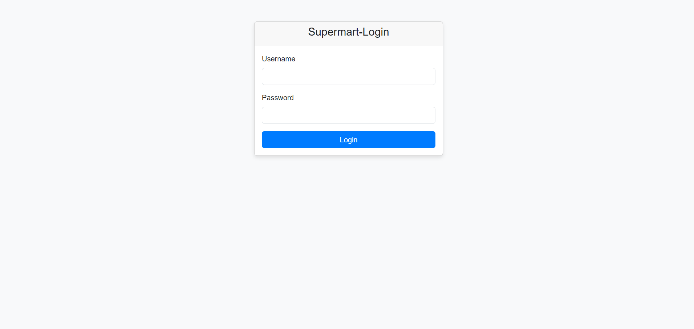
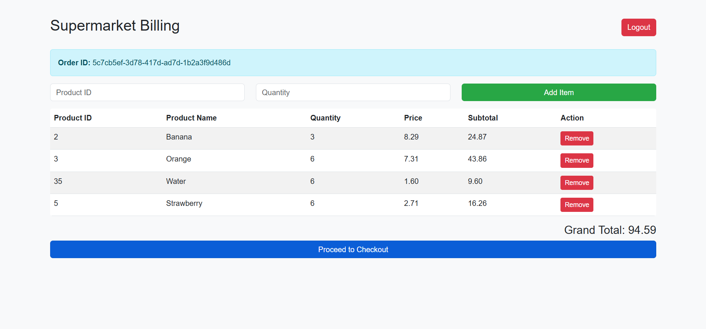
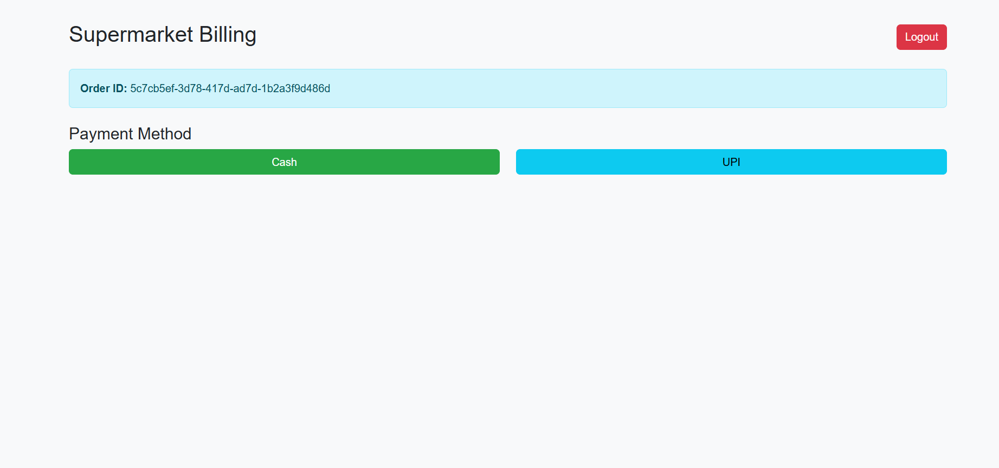
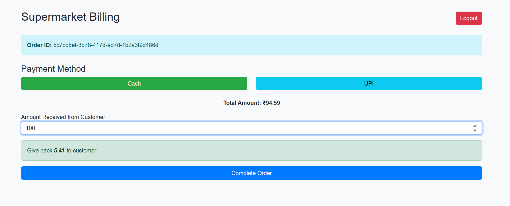
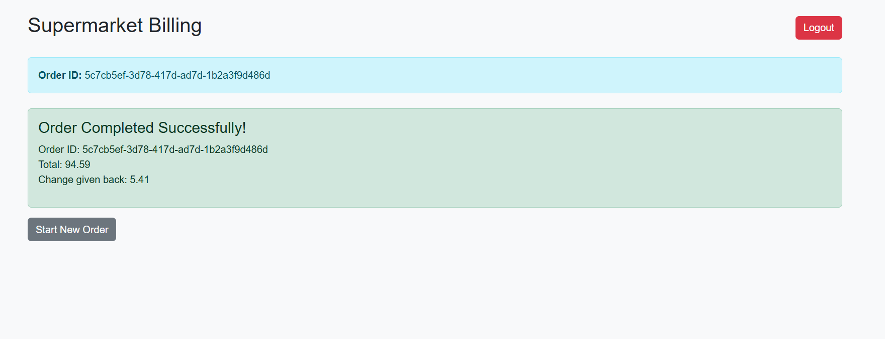
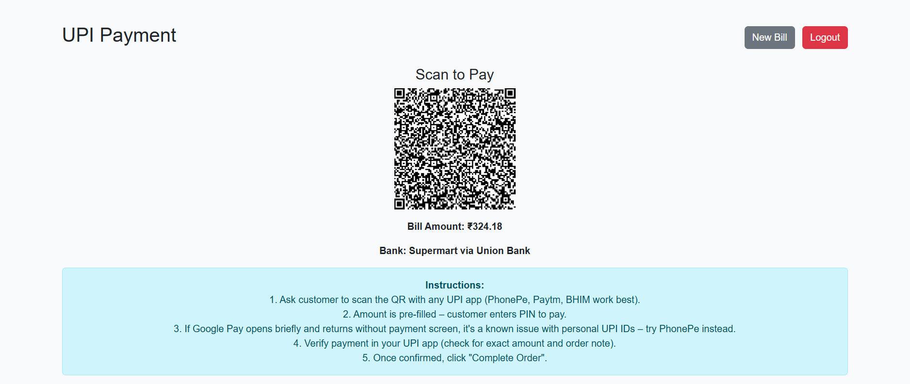
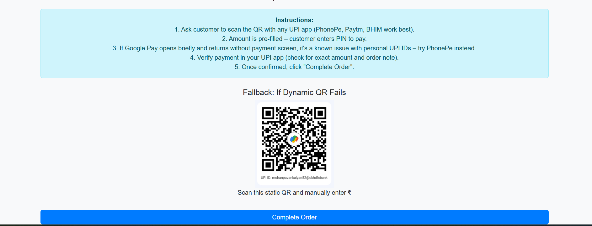
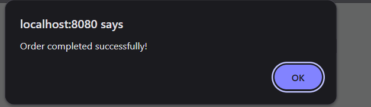
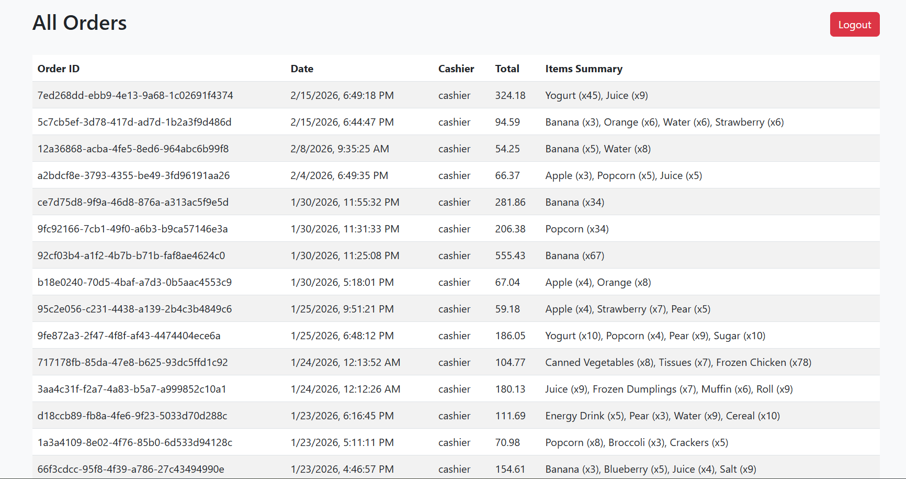

# 🛒 Supermarket Billing System

### Spring Boot + Java + Thymeleaf + UPI Integration

A complete **Supermarket Billing Web Application** built using **Spring Boot**, designed to simulate real-world billing operations.

---

# 🚀 Features

✔ Secure Login System  
✔ Add / Remove Products  
✔ Automatic Total Calculation  
✔ Cash & UPI Payments  
✔ Order History Tracking  

---

# 🛠 Tech Stack

| Layer | Technology |
|-------|------------|
| Backend | Spring Boot |
| Frontend | Thymeleaf + HTML + CSS |
| Database | MySQL / H2 |
| Build Tool | Maven |
| Java Version | 17+ |
| Architecture | MVC Pattern |

---

# 📌 Application Flow (With Screenshots)

## 1️⃣ Login Page

Users must login to access the billing system.



---

## 2️⃣ Supermarket Billing – Add Products



---

## 3️⃣ Select Payment Method



---

## 4️⃣ Cash Payment





---

## 5️⃣ UPI Payment





---

## 6️⃣ Payment Verification


---

## 7️⃣ Order Completion



---

## 8️⃣ All Orders



---

# 📦 Project Structure

```
super-market-billing-system/
│
├── src/
├── docs/
│   └── images/
├── pom.xml
└── README.md
```

---

# ⚙ How To Run

```bash
mvn spring-boot:run
```

Open:

```
http://localhost:8080
```

---

⭐ If you like this project, give it a star on GitHub!
